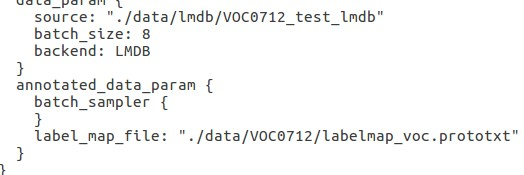

#                           Ultra-96平台基于DPU的SSD算法实现

####                                                                                          Edward Bao,  Xinyu Hu, Le Chang

# 一、板卡准备

## 1. Ultra 96板卡安装镜像文件

（1）进入Xilinx官网下载Ultra_96镜像文件，网址为：

https://www.xilinx.com/products/design-tools/ai-inference/ai-developer-hub.html#overview


（2）用烧录软件进行镜像烧录


​        点击Flash即可进行烧录，此过程有可能会出现烧录失败的现象，没关系，多烧录几次就好了，实在不行就需要更换SD卡。

## 2. Ultra 96板卡准备

（1）板卡连网

​           **板卡有两种访问方式：**

​                 a. 通过串口访问

​                 b. 通过wifi共享热点，SSH访问

​        在这里，我们选用第二种方式，手机开放热点，让笔记本和板卡同时连上笔记本网络。


笔记本SSH访问：


## 3. Ultra 96板卡安装DNNDK

（1）官网下载DNNK的SDK安装包：

https://www.xilinx.com/products/design-tools/ai-inference/ai-developer-hub.html#overview


（2）解压安装包，通过SSH拷入Ultra_96板卡


注：解压后可以看到有两个压缩包，

```
XILINX_AI_SDK-V1.0.0-BUILD-16-2019-05-31.tar.gz   # 放入板子中
------Ultra96                                      
---------XILINX_AI_SDK-Ultra96.tar.gz              #只需要拷这个进板卡

xilinx_dnndk_v3.0_190624                          # 放入板子中 
---xilinx_dnndk_v3.0
------Ultra96                                     #只需要拷这个进板卡
--------- pkgs
--------- install.sh
```

（1）切换到Ultra-96文件夹下的，执行

```
cd Ultra96
chmod 777 install.sh
```

（2）执行DNNDK的安装程序

```
./install.sh
```


（3）查看DNNDK的安装版本

```
dexplorer --v
```

## 4. 安装DNNDK SDK

在Ultra96目录下可以看到**XILINX_AI_SDK-Ultra96.tar.gz**压缩包，解压此文件：

```
tar zxvf XILINX_AI_SDK-Ultra96..tar.gz -C /
```


执行此条命令后，即可将压缩包中的库函数等文件分别解压到板子的\usr和\etc路径下。

解压全部完成时，所有的.so文件均已部署。


## 注：

**（1）若SDK在解压的时候，出现存储不足的时候，用DiskGenius软件进行SD卡进行扩容。**


扩容前：


扩容后：


可参考教程：http://www.cubie.cc/forum.php?mod=viewthread&amp;tid=705

**（2）若在用dexplorer  --v查看版本号的时候出现找不到dexplorer，不要惊慌，按照以下步骤来：**

```
cd /usr/local/bin/
chmod 777 dexplorer
dexplorer --v
```


即可查看DNNDK的版本号

# 二、DNNDK编译

## 1. 数据集数据转换

注：本步骤针对使用DPU的ssd网络训练为后续decent和dnnc提供数据

### （1）caffe 的安装

由于实验条件有限，没有GPU等条件，选择安装CPU版本的caffe版本

本实验环境为在虚拟机下运行Ubuntu16.04

a. 获取caffe的源码

```shell
git clone https://github.com/weiliu89/caffe.git
cd caffe
git checkout ssd
```

b. 进入下载好的caffe目录，复制配置文件。如果你安装caffe目录下的配置文件已经配置好，可以将其复制过来

```shell
cd   /home/xxx/caffe
cp  Makefile.config.example  Makefile.config   #这里写代码片
gedit Makefile.config                          #对caffe进行更改，将gpu改为cpu
```

c. 修改cpu的配置Makefile.config，source文件中也提供了cpu的配置文件可以直接 make

```shell
去掉注释CPU_ONLY :=1  
注释掉CUDA有关的行：  
#CUDA_DIR := /usr/local/cuda  
#CUDA_ARCH := -gencode arch=compute_20,code=sm_20 \  
#        -gencode arch=compute_20,code=sm_21 \  
#        -gencode arch=compute_30,code=sm_30 \  
#        -gencode arch=compute_35,code=sm_35 \  
#        -gencode arch=compute_50,code=sm_50 \  
#        -gencode arch=compute_50,code=compute_50  
去掉注释WITH_PYTHON_LAYER := 1  
INCLUDE_DIRS := $(PYTHON_INCLUDE) /usr/local/include /usr/include/hdf5/serial  
LIBRARY_DIRS := $(PYTHON_LIB) /usr/local/lib /usr/lib /usr/lib/i386-linux-gnu/hdf5/serial /usr/lib/x86_64-linux-gnu /usr/lib/x86_64-linux-gnu/hdf5/serial  
#TEST_GPUID := 0  
```

d. 配置caffe，此过程和caffe编译是一样的，配置三件套

```shell
make all -j8
make runtest -j8
make pycaffe -j8
```

e. 更改~/.bashrc file ，将caffe的路径加入到bashrc

```
gedit ~/.bashrc file
#在gedit的最后一行加入
export CAFFE_ROOT=/这里是你的caffe的绝对路径/caffe-ssd
```

f. 将caffe使用的python环境变量也加载到~/.brash文件中，并完成环境变量的生效

```shell
echo "export PYTHONPATH=$CAFFE_ROOT/python"    
source ~/.bashrc 
```

g. 检查python是否安装成功

```shell
echo "export PYTHONPATH=$CAFFE_ROOT/python"    
source ~/.bashrc 
```

出现效果证明caffe配置成功

.png)

h. 创建 **$CAFFE_ROOT/data/VOC0712** ，在这个目录下解压三个VOC数据集，提供了下载的路径

http://host.robots.ox.ac.uk/pascal/VOC/voc2012/VOCtrainval_11-May-2012.tar

http://host.robots.ox.ac.uk/pascal/VOC/voc2007/VOCtrainval_06-Nov-2007.tar

http://host.robots.ox.ac.uk/pascal/VOC/voc2007/VOCtest_06-Nov-2007.tar

### （2）LMDB格式数据生成

进入目录下运行

```
cd $CAFFE_ROOT/data/VOC0712
source create_list.sh
source create_data.sh
cp -r examples/* ../../examples
```

出现下面截图


在**$CAFFE_ROOT/examples/VOC0712** 存在这两个文件

.png)

```
cd $CAFFE_ROOT/examples/VOC0712_trainval_lmdb
```

出现这两个文件，证明转换成功

.png)


## 2. DNNDK文件准备

DNNDK的文件按照DNNDK_Project文件夹中的文件格式准备：


### **（1） 拷入训练好的caffemode**        

```
               VGG_VOC0712_SSD_300x300_iter_120000.caffemodel
```

### **（2）生成train_test.prototxt**

使用train.prototxt和test.protoxt合成train_test.prototxt

​               a. 复制“train.prototxt”并将其重命名为“train_test.protoxt”。以下步骤将对此train_test.prototxt文件进行一些编辑，以使其与DPU / DNNDK兼容。

​                b. 接下来打开test.prototxt文件并将第一层（名为“data”）复制到train_test.prototxt作为第二层。确保不要复制test.prototxt的第一行，即name: "VGG_VOC0712_SSD_300x300_test"。在“train_test.prototxt”文件的第137和138行之间插入此层。


​        c. 接下来从“test.prototxt”复制最后5层（从名为“mbox_conf_reshape”的层开始，该层应该在第1591行附近，在最后一层结束）并将它们附加到“train_test.prototxt”的末尾。


​           d. 接下来，在 **mbox_conf_reshape** **，** **mbox_conf_softmax** 和 **mbox_conf_flatten** 层中添加一个参数，以便确保这些图层仅用于测试。需要添加的条目如下：


​              e. 在**train_test.prototxt**中，需要使用BatchNorm和Scale图层替换Normalize图层，因为DPU不支持Normalize。 在原始SSD模型中，这称为**conv4_3_norm**， 可以使用以下步骤替换图层：

​               f. 删除名为“conv4_3_norm”的Normalize层，该层应从第972行开始并在第985行附近结束。

​               g. 在“conv4_3”和“relu4_3”层之间插入Batchnorm层和比例层。


​                   h. 将名为“conv4_3_norm”的原型文本中的其他底层替换**conv4_3**（应该有三个），它们显示为“bottom：”conv4_3_norm“`。

​                   i. 接下来通过将“fc6”层的num_output由原来的1024改为682。原因是DPU仅支持12位来描述参数的数量。扩张为6时，输出参数的数量将为6143，这对于DPU来说太多了。

**由于对图层的这种更改，需要在图层本身以及它们连接的图层中重命名fc6和fc7图层。为此，建议只需使用“fc6_682”查找/替换名称“fc6”，使用“fc7_682”替换名称“fc7”。**


### （3）修改生成的train_test.prototxt或者使用文件夹给定的train_test.prototxt，并重命名为float.prototxt


将其第一层TRAIN修改为如下格式


修改float.prototxt中的路径，需要修改的路径为以下几处：





## 3. 编译decent

修改decent，在虚拟机中使用cpu编译


执行以下指令，可以得到压缩后文件：**deploy.caffemodel**，**deploy.prototxt**

```
sudo ./decent_ssd.sh
```


## 4. 编译dnnc

修改对应板卡的dpu：

 


执行以下指令生成.elf文件：

```
sudo ./dnnc_ssd.sh
```


# 三、板卡程序设计

进入板卡SSD文件夹，其文件分布如下所示：


文件及功能如下所示:

```
model                   # 保存DNNC编译过的模型elf文件
--- dpu_ssd.elf         # 模型文件        
src                     # 存放源程序   
--- main.cc             # 主程序
video                   # 存放待检视频
Makefile                # 编译文件
run.sh                  # 程序运行脚本
stop.sh                 #程序停止脚本  
```

## 1. 修改Makefile

```
PROJECT   =    detection
OBJ       :=   main.o dpu_ssd.elf ssd_detector.o prior_boxes.o

CXX       :=   g++
CC        :=   gcc

# linking libraries of OpenCV
LDFLAGS   = $(shell pkg-config --libs opencv)

# linking libraries of DNNDK 
LDFLAGS   +=  -lhineon -ln2cube -lpthread -ldputils -lSDL

CUR_DIR   =   $(shell pwd)
SRC       =   $(CUR_DIR)/src
BUILD     =   $(CUR_DIR)/build
MODEL	  =   $(CUR_DIR)/model
VPATH     =   $(SRC)

CFLAGS    :=  -g -O0 -mcpu=cortex-a53 -Wpointer-arith -std=c++11 -ffast-math

all: $(BUILD) $(PROJECT)
 
$(PROJECT): $(OBJ)
	$(CXX) $(CFLAGS) $(addprefix $(BUILD)/, $^) -o $@ $(LDFLAGS)
 
%.o : %.cc
	$(CXX) -c $(CFLAGS) $< -o $(BUILD)/$@

%.o : %.cpp
	$(CXX) -c $(CFLAGS) $< -o $(BUILD)/$@

%.elf : 
	cp $(MODEL)/$@ $(BUILD)/$@ 

clean:
	$(RM) -r $(BUILD)
	$(RM) $(PROJECT)

$(BUILD) : 
	-mkdir -p $@
```

​        从Makefile可以看出，在编译后生成build文件夹，在文件夹中会生成相应的**.o**文件和**elf**文件，在同级目录下会生成可执行文件**detection**.

## 2. 程序执行

```
cd SSD
make    # 编译
chmod 777 run.sh   # 如果是第一次执行
./run.sh       # 程序运行
./stop.sh       # 程序结束
```


## 注：另一种程序执行方法：

​        除了上面我们自己写**源程序**、**Makefile**和**elf**来编译执行网络外，也可以利用镜像文件中连接库存储的模型和程序来调用执行。在SSD2文件夹中，我们利用了这种方法来实施SSD算法。


源程序（test_ssd_ADAS_PEDESTRIAN_640x360.cpp）如下：

```
#include <xilinx/ssd/ssd.hpp>
#include <iostream>
#include <xilinx/ssd/ssd.hpp>
#include <iostream>
#include <memory>
#include <glog/logging.h>
#include <opencv2/core.hpp>
#include <opencv2/highgui.hpp>
#include <opencv2/imgproc.hpp>
#include <xilinx/demo/demo.hpp>

#include <opencv2/opencv.hpp>
#include <map>
#include<time.h>
#include <string>
using namespace std;
using namespace cv;
#define B_ 255
#define G_ 255
#define R_ 255
typedef struct
{	int label;
	char names[20];
	int B;
	int G;
	int R;
} parameter_struct;
char info[30];
parameter_struct parameter[20]=
{
	/* if uncommon we set the colors all white*/
	{0,"aeroplane",B_,G_,R_},
	{1,"person",128,0,128},//purple   bicycle ==> person
	{2,"bird",B_,G_,R_},
	{3,"boat",B_,G_,R_},
	{4,"bottle",0,97,255},//lemon
	{5,"bus",255,0,0},//blue
	{6,"car",0,255,255},//yellow
	{7,"cat",B_,G_,R_},
	{8,"chair",255,0,0},//green
	{9,"cow",B_,G_,R_},
	{10,"diningtable",128,0,128},//purple
	{11,"dog",B_,G_,R_},
	{12,"horse",B_,G_,R_},
	{13,"motorbike",B_,G_,R_},
	{14,"bicycle",0,0,255},//red     person ==> bicycle
	{15,"pottedplant",0,0,0},//black
	{16,"sheep",B_,G_,R_},
	{17,"sofa",0,255,255},//yellow
	{18,"train",B_,G_,R_},
	{18,"tvmonitor",255,0,0}//blue
};

int main(int argc, char *argv[])
{

  cv::VideoCapture cap(0);

cap.set(CV_CAP_PROP_FRAME_WIDTH,640);
cap.set(CV_CAP_PROP_FRAME_HEIGHT,480);
cap.set(CV_CAP_PROP_FPS,30);
float fps2;
  auto ssd = xilinx::ssd::SSD::create(xilinx::ssd::ADAS_PEDESTRIAN_640x360,true);
  
int font=CV_FONT_HERSHEY_SIMPLEX;
//cvInitFont(&font,CV_FONT_HERSHEY_SIMPLEX|CV_FONT_ITALIC);
while(1)
{int begintime,endtime;
	Mat img;
	cap>>img;
	begintime=clock();
  auto results = ssd->run(img);

  for(auto &box : results.bboxes){
      int label = box.label;
      float xmin = box.x * img.cols + 1;
      float ymin = box.y * img.rows + 1;
      float xmax = xmin + box.width * img.cols;
      float ymax = ymin + box.height * img.rows;
      if(xmin < 0.) xmin = 1.;
      if(ymin < 0.) ymin = 1.;
      if(xmax > img.cols) xmax = img.cols;
      if(ymax > img.rows) ymax = img.rows;
      float confidence = box.score;

      rectangle(img, Point(xmin, ymin), Point(xmax, ymax), Scalar(parameter[label].B, 			parameter[label].G, parameter[label].R),
                  1, 1, 0);
	char buf[20];
	sprintf(buf,"  %0.4f",confidence);
	strcpy(info,parameter[label].names);
	strcat(info,buf);
        putText(img,info,cvPoint(xmin,ymin),CV_FONT_HERSHEY_SIMPLEX,0.5,Scalar(parameter[label].B,parameter[label].G, parameter[label].R),0,0,false);
  //imwrite("sample_yolov3_customer_provided_result.jpg", img);
	}
	//imshow("current",img);
//waitKey(2);
	endtime=clock();
	fps2=1/((endtime-begintime)/1000000.0);
	char buf2[20];
	sprintf(buf2,"  %3.2ffps",fps2);
        putText(img,buf2,cvPoint(5,15),CV_FONT_HERSHEY_SIMPLEX,0.5,Scalar(0,0,255),0,0,false);
	//printf("%3.2ffps\n",fps2);
	imshow("current",img);
	waitKey(2);
}	
  return 0;
}
```

执行以下程序：

```
cd SSD2
chmod 777 build.sh
./build.sh            #编译
./ssd_test            #打开摄像头实时检测
```


